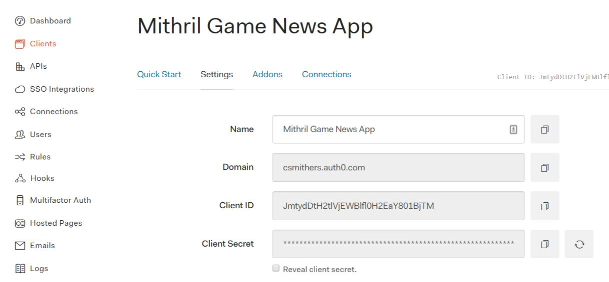

# Learn MithrilJS: Build a Game News App with Authentication


## TL;DR:  
This tutorial will  introduce you to [Mithril](https://Mithril.js.org/), a JavaScript framework.  Mithril is a client-side JavaScript framework for building single page applications (SPAs).  Mithril has efficiency in mind.  

We are going to make an app that will retrieve news of a game using the [Valve Steam API](https://developer.valvesoftware.com/wiki/Steam_Web_API).  After that, we will use [Auth0](https://auth0.com/) to authenticate with a login.

### Meet Mithril

Mithril is a client-side JavaScript MVC framework created by Leo Horie. Mithril is light and speedy.  It's named after the metal used in armor from J.R.R. Tolkein's Lord of the Rings trilogy.  You will find it used in the Guild Wars 2 game, Nike, and Udemy. 

### Purpose and Features

It's small, fast, and provides routing and XHR (AJAX) out of the box.  The creators describe the framework as "pragmatic."  Mithril shows a [tremendous performance boost](https://Mithril.js.org/framework-comparison.html) compared to VueJS, Angular, and React counterparts.  The Mithril documentation is detailed so that you will feel confident while using the framework.  It also supports browsers back until Internet Explorer 9 with no polyfills required. What you are left with is code that's easy to read, maintain, and document. 

### Learning Resources

You can check out Mithril on its [Github page](https://github.com/MithrilJS/Mithril.js/) or [website](https://Mithril.js.org/).  The site provides information on how to get set up as well as having a simple Hello world tutorial, documentation, and examples.  You can join the [Gitter group](https://gitter.im/Mithriljs/Mithril.js) to get help or ask about it on Stack Overflow with the Mithril tag. The GitHub page has examples including one by [Dave Gauer](http://ratfactor.com/Mithril1.html?/shire) which has a thorough, humorous tutorial taking the framework to its Lord of the Rings roots.

## Tutorial

The [Steam Web API](https://developer.valvesoftware.com/wiki/Steam_Web_API) is a way to get information on other games, players, updates, and more.  We will make an app to explore Mithril hands-on to create something that will tell us news on the new Middle Earth: Shadow of War game.  When we have the main app done, we will then add authentication to it with Auth0.  We will also do styling so that your app is attractive and easy to use.  This tutorial assumes that you have worked with JavaScript before and are agnostic or don't use frameworks for it.

### Setup

We will begin the tutorial by setting up our tools we will be using. Without further ado, let's get started!

### Dependencies

Again, part of Mithril's beauty is that it frees you of a long list of dependencies so this will be brief. To start with, I will need to have [Node](https://nodejs.org/en/) installed on your system.   If you don't have it already, you can download it from their [website](https://nodejs.org/en/download/).  There are many ways to install Mithril on your system if you prefer [other](https://Mithril.js.org/installation.html) such as with Bower is you prefer that instead. We will use Webpack like the Mithril page does: `npm install mithril --save`, run `npm install webpack --save` and then `npm init --yes` to generate the `package.json` file. We will be using es6 syntax, so if you don't have [Babel](https://babeljs.io/blog/2015/10/31/setting-up-babel-6) set up you will want to do so.

Using npm, we will use the `npm --install yes`. Update the package file to call up the script with `"start": "webpack src/index.js bin/app.js -d --watch"` in the scripts.

One of the advantages of Mithril is that it is fairly boilerplate-free. The reason why is to preserve the tiny size of Mithril so you only use what you need. You won't be locked into a long list of dependencies which makes everything lighter. If you want to use a boilerplate, there are several of them listed in the [developer resources](https://github.com/MithrilJS/Mithril.js/wiki/Developer-Tools#starter-kits) on the Github page. We will keep this tutorial simple as well as with the spirit of Mithril and keep frameworks minimal. You will need a `src/index.js` file and an `index.html`. 

As developers, we value a good production app and minify things where we can so we will do the same here. The Webpack bundle can be minified so we can make this follow best practices. Add `"build": "webpack src/index.js bin/app.js -p"` to the packages file in the scripts.

For styling, we will use [Bootstrap](http://getbootstrap.com/). For this tutorial, I am going to use a CDN. If you want a local installation, run `npm install bootstrap -g` to make Bootstrap global on your system and then import it in the `index.js` file.

We will use the [Steam  Web API](https://developer.valvesoftware.com/wiki/Steam_Web_API).  If you don't have a Steam account already, it is free as is the API.  If you already have an account, sign in first.  Once you are logged into an account, you can get a key from [here](https://steamcommunity.com/dev/apikey).  We will use the [CORS](ttps://cors.now.sh) tool to help the Steam API to work without needing a server.


### Scaffolding

Now it is time to get the skeleton parts made. Mithril uses HTML5, so you won't need the `html`, `head`, and `body` tags. The respective DOM elements are still there though implicitly when a browser renders the markup. This keeps with the theme of simplicity in Mithril. When you make a Mithril application, the application lives in a namespace and will contain modules. This is the model part of the MVC framework. Each module will represent a component or a page. In other words, we bind each HTML tag that exists in the DOM to the Mithril so you can get a virtual HTML page without having to actually write HTML. If you have worked with the popular frameworks, then this should feel similar. To demonstrate this, here's the main layout:

```javascript
// index.js
import m from 'mithril';

const App = {
    view: function () {
        return ('.container',
            m('h1', 'Hello Mithril'),
        );
    }
};
m.mount(document.body, App);
```

Which gives us this as a result:

```
<html>
	<head>
	    <title>Hello Mithril</title>
	</head>
	  <body>
	    <script src="bin/app.js"></script>
	  </body>
</html>
```

Not bad, eh? Almost time to make this app do cool stuff. You may have noticed the "m" object in the code. That's Mithril being called so it automatically figures out what we are doing. As we add the rest of our app, you will see why this is awesome. Now that we have the landing page ready, it is time to make the app work.  We will want to make a module to store the state of a game's news, so inside `src` directory, make a models directory.  This is where the [components](https://mithril.js.org/components.html) will live.

### Components

Let's now start making this app do something by adding a file named `game-news-list.js` that contains:

```javascript
// src/views/game-news-list.js
import m from 'mithril';
import navbar from './navbar';
import { 
    news
} from './news';

const url = 'https://cors.now.sh/http://api.steampowered.com/ISteamNews/GetNewsForApp/v0002/?appid=241930&count=3&maxlength=300&format=json';

const gameNewsList = {
    oninit() {
        m.request(url).then(data => {
            this.data = data;
            console.log(this.data);
        });
    },
    view() {
        return m(".game-news-list",
            m(navbar),
            m(".container-fluid",
                m("img[alt='Game art'][src='http://cdn.wccftech.com/wp-content/uploads/2017/02/Middle-Earth-Shadow-of-War-Art.png']")
            ),
            this.data
                ? this.data.appnews.newsitems.map(newsItem => m(".newsItem", newsItem.title))
                : m(".loading", "Loading game news list...")
        );
    }
};

export default gameNewsList;
```

Mithril treats components as objects with view methods. Another thing you can do is to use the `getElementByID` method and then use it to tie into an HTML tag.  If you want to try a nice tool using this approach, Arthur Clemens made a [tool](http://arthurclemens.github.io/mithril-template-converter/index.html) that will turn HTML into Mithril JS.  Now we have the basic structure set up for a list of news items.  We now need to get the data to populate it.

We will also want to be able to handle the state of our game news list changing at unpredictable times when someone publishes an article about it.  

Let's create a file called `news.js`:

```javascript
//src/views/news.js
import m from 'mithril';
import stream from 'mithril/stream';

export const news = stream([]);

const cors = 'https://cors.now.sh/'

const News = {
    oninit: function(){
        m.request(cors + 'http://api.steampowered.com/ISteamNews/GetNewsForApp/v0002/?appid=241930&count=3&maxlength=300&format=json')
            .then(data => {
                this.data = data
            })
    },
    view: function(){
        return m("li", JSON.stringify(this.data, undefined, 2))
    }
}
```

It's looking better already.  The method from the Steam API we will be using in this app will be the GetNewsForApp one and the app id for the Middle Earth: Shadow of War is 241930.  We can check it against this [url](http://api.steampowered.com/ISteamNews/GetNewsForApp/v0002/?appid=241930&count=5&maxlength=300&format=json) to see that things are correct. 


### Styling
Now that we have what we need from Steam, it's time to make this look nicer and become responsive.  

This app can really use a navbar where the header is.  Delete the header from the `game-news-list.js` file since we are going to make this a navbar instead.  Let's take care of the navbar component:

```javascript
// src/views/navbar.js
import m from 'mithril';
import loginButton from './login-button';

const navbar = {
    view: vnode =>
      m("nav.navbar.navbar-default",
        m(".container-fluid", [
          m(".navbar-header", [
            m("button.navbar-toggle.collapsed[aria-controls='navbar'][aria-expanded='false'][data-target='#navbar'][data-toggle='collapse'][type='button']", [
              m("span.sr-only",
                "Toggle navigation"
              ),
              m("span.icon-bar"),
              m("span.icon-bar"),
              m("span.icon-bar")
            ]),
            m("a.navbar-brand[href='#']",
              "Middle Earth: Shadow of War Game News"
            ),
          ]),
          m(loginButton)
        ])
      )
  }

  export default navbar;
```

Import the navbar component and call it up with `m(navbar)` in `game-news-list.js` and `index.js` inside the `view` function.  It is starting to look appealing, but we should change the styling some more to give it a modern look (and maybe a touch of Mordor).  The header became a navbar, so let's add an indigo palette from the [Google Material Design guidelines](https://material.io/guidelines/style/color.html#color-color-palette).  We can also make some elements have a little padding so the page looks nicer.  We'll put it in the same level as the `index.html` and simply call it `style.css`.

```css
/*style.css*/
body {
    background-color: #1A237E;
}

img {
    padding: 15px 15px 15px 15px;
    vertical-align: middle;
    width: auto;
    height: auto;
    display: block;
    margin: auto;
}

.container-fluid {
    max-block-size: 600px;
    background-color: #3F51B5;
    color: #E8EAF6;
}


.loading {
    padding: 15px 15px 15px 15px;
    margin: 15px 15px;
    background-color: #E8EAF6;
}

.newsItem {
    position: relative;
    display: block;
    padding: 15px 15px 15px 15px;
    margin: 15px 15px;
    background-color: #E8EAF6;
}

.navbar-default,
.navbar-brand {
    background-color: #3F51B5;
    color: #E8EAF6;
}

.navbar>.container-fluid .navbar-brand {
    margin-left: -15px;
    color: #E8EAF6;
    background-color: #3F51B5;
}

.navbar-collapse.collapse {
    background-color: #3F51B5;
}
```


### Authentication

The final parts of our work will be to add authentication. We will do this with a hosted login page.  As developers, we are challenged with finding the most secure solutions possible in our work. It's arguably now becoming equally important as solid back-end logic and a good user interface.  Another challenge to us as developers is to make authentication easy on the user yet deliver effective security. To get started on the hosted login, we will do this with the Auth0 Hosted Login page.  If you do not have an Auth0 account, it's free to use.  

The Hosted Login Page is easily customizable right from the Dashboard. By default, the Hosted Login Page uses Auth0's Lock Widget to authenticate your users, but the code of the Hosted Login Page can be customized to replace Lock with the Lock Passwordless widget, or an entirely custom UI can be built in its place, using the Auth0.js SDK for authentication if you want to explore those further.

1.  Let's go the the [Auth0 dashboard](https://manage.auth0.com/#/) to begin. In the Dashboard, you can enable a custom Hosted Login Page by navigating to the left-hand menu and selecting the Hosted Pages menu. We will have to create a client so we can enable this for our application.  This is going to be a single-page application.


JavaScript is the technology we are using, so select it from the technologies.  The next prompt will tell us that we have to configure the callback URLs.  We have already installed Auth0, so we will proceed to the next step where we will go to the`index.html` file and paste the CDN in as a script: `<script type="text/javascript" src="node_modules/auth0-js/build/auth0.js"></script>`.  

We will need to get the callback url in Auth0, so let's take care of that by going back to the Auth0 dashboard, selecting Clients on the left and then select our app.  The callback urls are in the settings tab.

 

For a single-page app like ours, you can just put that in the Allowed Origins/CORS box closer to the bottom and click Save.  for other appliations, you would set the callback url to `http://localhost:5000` and click the Save button on the bottom.  

2.  The next step is to set up a hosted login page.  You can find the menu to that on the left-hand side menu.  Toggle the switch to to enable a login page. 


2.  Next we will choose the login technology we want to use. You will have three options to use the hosted page; Lock, Lock Passwordless, and Auth0.js v8 which involves using the SDK.  We will be using the Lock.  For your reference, here's the breakdown of each one:

* Lock - This is the easiest route to utilize the hosted pages.  It's prebuilt and customizable that easily allows the users to login.
* Lock Passwordless - The Lock Passwordless is similar to the Lock in its UI.  Where it differs is that instead of offering options to the user, it will ask the user for an email or number to receive SMS messages to authenticate without paswords.
* Auth0.js v8 - Auth0.js is the SDK used for interacting with the Auth0 authentication API. This is the option you would choose for anything requiring special handling and where more than logins are needed for your applications.

3.  After you toggle the switch, you will have noticed an interactive text editor become activated.   Since we are using Lock, we can alter modify the page in the editor for how it looks and interacts. One thing to keep in mind is the Hosted Login Page customizations run per tenant. There's many options to run multiple clients, but for this tutorial, we will keep to just one for now.

4.  [Customization Options](https://auth0.com/docs/hosted-pages/login#1-enable-the-hosted-login-page) - You can customize the Hosted Login Page inside the editot. Using Lock, ywe can change its appearance and behaviors to suit our needs.  All changes to the page's appearance and/or behavior will apply to all users shown this login page, regardless of the client or connection. Let's discuss the different parameters we can tailor:

* Query String Parameters - You can add query string parameters to the URL you are using to call your Hosted Login Page from your application, and use those items to customize its behavior or appearance.
* Parameters for the Authorize Endpoint - This is where you will put in the endpoint for your app whether you decide to use `Auth0.js` or call the endpoint directly.
* Login Hint - If you want, you can allow login hints
* Callback URL - Once the user is authenticated, this is were they will get directed

We won't do any special customization in this tutorial, but if you have any special themes or branding, this is where you will customize the login page.

### Implement Authentication
Now we can create a new component for a login by making a button and call it `login-button.js`.  Once you have that, import it into the `navbar,js` file right outside the `container-fluid` class.  We will style it as well in the same style file as the other styling we have done. The link you will use in the button will be the one you will get from the hosted login page when you click the preview button.

```javascript
//src/viewslogin-button.css
import m from 'mithril';

const loginButton = {
  view: vnode =>
  m("a.btn.btn-secondary.btn-lg.active[href='your auth0 url']", 
  "Login"
  )
}

export default loginButton;
```

```css
/*style.css*/
a.btn.btn-secondary.btn-sm.active {
    background-color: transparent;
    color: #E8EAF6;
    border-color: #E8EAF6;
    align: right;
    position: absolute;
    right: 0px;
    width: 100px;
    padding: 10px;
}
```

### Conclusion
In this tutorial we were introduced to the Mithril JS framework. We got to explore the ease in its use of a virtual DOM and how to create and update HTML.  We have created components that allowed us to make an app that talked to a server. We've demonstrated how simple it can be to perform routing for a single page application and finally authenticated a user. There are many more features that MithrilJS offers such as being a great way to learn functional programming and the effortless routing.

To learn more about the Mithril JS library, you can peruse the docs at [Mithril's website](mithriljs.org) or get in touch with the community and development team by checking out the [Mithril GitHub](https://github.com/MithrilJS/mithril.js) and [Mithril Gitter](https://gitter.im/mithriljs/mithril.js).

If you are wonder how Mithril JS can help you as a JavaScript developer trying to improve performance in your web apps, check out Mithril. Regardless of experience level, Mithril is easy to pick up from the friendly documentation to the similarities it has with React frameworks. Hopefully you enjoyed this tutorial and are ready to bring Mithril to good use with your own web apps.